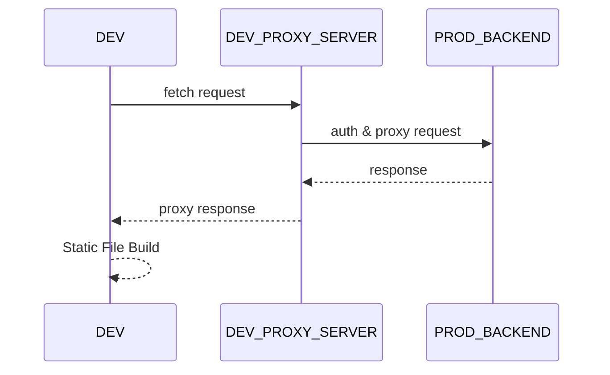

## Installing
### front
```bash
npx create-next-app@latest --use-pnpm
```

### proxy-dev-server
```
pnpm add -D hono @hono/node-server tsx
```
## ADR
- フロント…静的ファイルをビルドできるならVite(React)でも可
- バックエンド…proxy-serverを書く



## .env.local

```env
USERNAME=
PASSWORD=
```